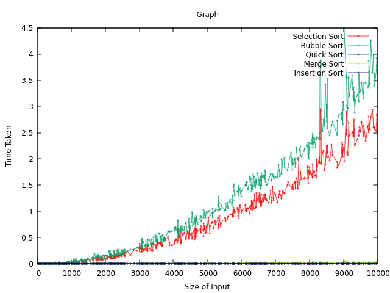

## Comparision of sorting algorithms

</img>

**The graph in the image represents the time taken by five different sorting algorithms: Selection Sort, Bubble Sort, Quick Sort, Merge Sort, and Insertion Sort, for increasing input sizes.**

- **Selection Sort** (Red Line): This algorithm has a time complexity of O(n^2), which means the time taken increases quadratically with the size of the input. This is reflected in the steep, almost linear curve in the graph.

- **Bubble Sort** (Green Line): Like Selection Sort, Bubble Sort also has a time complexity of O(n^2). The curve is similar to that of Selection Sort, indicating that it also takes significantly more time as the input size increases.

- **Quick Sort** (Blue Line): Quick Sort has an average time complexity of O(n log n), which is more efficient than the previous two algorithms for larger input sizes. This is shown by the flatter curve in the graph. Note: The speed of this algorithm depends drastically on the choosing of the Pivot element.

- **Merge Sort** (Light Green Line): Merge Sort also has a time complexity of O(n log n). Its curve is almost identical to that of Quick Sort, indicating similar efficiency.

- **Insertion Sort** (Dark Green Line): Although Insertion Sort has a worst-case time complexity of O(n^2), it is often faster for smaller arrays. This is represented by the flat start of the curve, which becomes steeper as the array size increases.

In summary, the graph effectively illustrates the time complexities of these sorting algorithms and how they perform with increasing input sizes. The steeper the curve, the less efficient the algorithm is for larger inputs. Conversely, flatter curves represent more efficient algorithms.